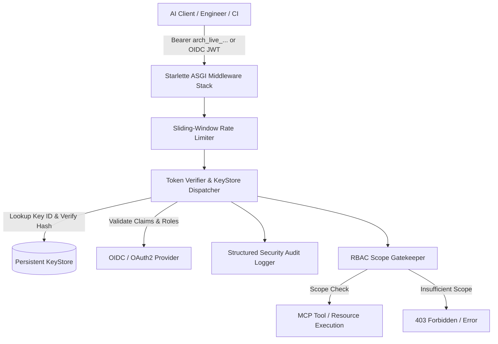
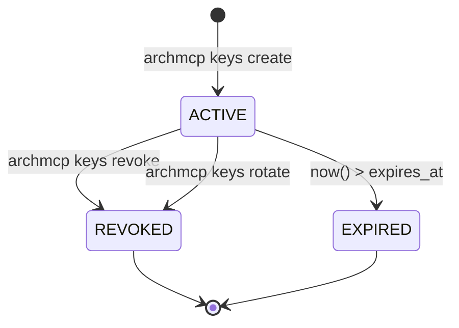

# Enterprise Security Architecture & Threat Model (STRIDE)

## 1. Executive Summary & Zero-Trust Posture

**ArchMCP** serves as an organization's centralized microservices architecture intelligence brain. Because it indexes sensitive internal assets—including proprietary service dependencies, private REST/gRPC routes, database schemas, and transitive blast-radius mappings—it enforces a **Zero-Trust Security Architecture**.



---

## 2. Threat Modeling: STRIDE Analysis

| STRIDE Threat Category | Potential Attack Vector | ArchMCP Countermeasure / Implementation |
| :--- | :--- | :--- |
| **Spoofing** | Forged or guessed API tokens; brute-forcing token strings | High-entropy CSPRNG tokens (`secrets.token_urlsafe(32)` yielding 256 bits of entropy); salted HMAC-SHA256 hashed storage; constant-time comparison (`hmac.compare_digest`) defeating timing side-channels; Key IDs (`kid`) partition lookup space. |
| **Tampering** | Modifying stored keys, payloads, or audit traces | Hash-protected key records; atomic file replacement on KeyStore writes; tamper-evident append-only structured audit logs. |
| **Repudiation** | Unaccountable actions taken by rogue clients or compromised keys | Every authentication attempt, failure, revocation, rotation, and tool execution is recorded in structured JSON with `event_id`, `actor`, `tenant_id`, `client_ip`, `action`, `status`, and `request_id`. |
| **Information Disclosure** | Unauthorized AI assistants or junior developers viewing sensitive database schemas or proprietary architecture | Fine-grained RBAC scopes: sensitive tools (`get_database_schema`, `find_table_owner`, `analyze_blast_radius`) require explicit elevated scopes (`arch:schema:read`, `arch:blast_radius`). Default accounts only receive `arch:read`. |
| **Denial of Service (DoS)** | Rapid querying or SSE connection flood exhausting server CPU and memory | In-memory sliding-window rate limiting per Key/IP; RFC standard headers (`X-RateLimit-Limit`, `X-RateLimit-Remaining`, `X-RateLimit-Reset`); instant 429 status rejection with retry backoff. |
| **Elevation of Privilege** | Replay of revoked keys or cross-tenant privilege escalation | Instant key revocation; automatic expiration checks on every request; strict multi-tenant boundary checks in `MetadataDatabase` partitioning records by `tenant_id`. |

---

## 3. Cryptographic Specification & Key Lifecycle

### Token Structure
API keys generated by ArchMCP adhere to a structured, human-scannable, and auditable format:

```text
arch_{environment}_{kid}_{secret}
 └───   └───          └───  └─── 32-byte cryptographically secure random token
   │      │             │
   │      │             └─ 12-char public Key ID (hex)
   │      └─ Tier ('live', 'test', 'dev')
   └─ Prefix Identifier
```

### Storage Security
- **No Plaintext Secret Storage**: Plaintext secrets are output **once** upon creation or rotation and are never saved to disk or logged.
- **Salted HMAC-SHA256**: Each key record stores a unique 16-byte random salt and HMAC-SHA256 hex digest:
  $$\text{Hash} = \text{HMAC-SHA256}(\text{Salt}, \text{Secret})$$
- **Timing Attack Mitigation**: Key verification compares computed and stored hashes using `hmac.compare_digest`, ensuring constant runtime regardless of byte match count.

### Lifecycle Transitions


---

## 4. Role-Based Access Control (RBAC) Matrix

| MCP Tool / Resource | Required Scope | `viewer` | `developer` | `architect` | `admin` |
| :--- | :--- | :---: | :---: | :---: | :---: |
| `search_microservices` | `arch:read` | ✅ | ✅ | ✅ | ✅ |
| `list_all_services` | `arch:read` | ✅ | ✅ | ✅ | ✅ |
| `get_service_details` | `arch:read` | ✅ | ✅ | ✅ | ✅ |
| `get_service_apis` | `arch:read` | ✅ | ✅ | ✅ | ✅ |
| `get_service_dependencies`| `arch:read` | ✅ | ✅ | ✅ | ✅ |
| `find_api_owner` | `arch:read` | ✅ | ✅ | ✅ | ✅ |
| `get_full_context_package`| `arch:context` / `arch:read`| ✅ | ✅ | ✅ | ✅ |
| `generate_sequence_diagram`| `arch:diagram` | ❌ | ✅ | ✅ | ✅ |
| `get_database_schema` | `arch:schema:read` | ❌ | ❌ | ✅ | ✅ |
| `find_table_owner` | `arch:schema:read` | ❌ | ❌ | ✅ | ✅ |
| `analyze_blast_radius` | `arch:blast_radius` | ❌ | ❌ | ✅ | ✅ |
| `import_openapi` | `arch:write` | ❌ | ❌ | ✅ | ✅ |
| `archmcp keys *` | `arch:admin` / `*` | ❌ | ❌ | ❌ | ✅ |

---

## 5. Enterprise OIDC / OAuth2 Integration

For organizations utilizing centralized Identity Providers (Okta, Microsoft Entra ID, Auth0, Keycloak), ArchMCP provides native JWT bearer validation:

1. Client acquires OAuth2 Bearer Token from corporate IdP with audience `archmcp-api`.
2. Client sends HTTP request with header: `Authorization: Bearer eyJ...`
3. ArchMCP unpacks token, verifies issuer (`iss`), audience (`aud`), expiration (`exp`), and maps IdP `roles` / `groups` to granular ArchMCP scopes.
4. Tenant partition is automatically resolved from IdP claim `tenant_id` or `org_id`.

---

## 6. Audit Event Schema Example

```json
{
  "event_id": "9b1deb4d-3b7d-4bad-9bdd-2b0d7b3dcb6d",
  "timestamp": "2026-08-24T21:45:00Z",
  "event_type": "TOOL_INVOCATION",
  "actor": "security-team",
  "tenant_id": "corp-default",
  "client_ip": "10.0.4.12",
  "action": "tool:analyze_blast_radius",
  "status": "SUCCESS",
  "details": {
    "service_id": "auth-service",
    "component": "/api/v1/auth/verify"
  },
  "request_id": "req-8f20b31e"
}
```
