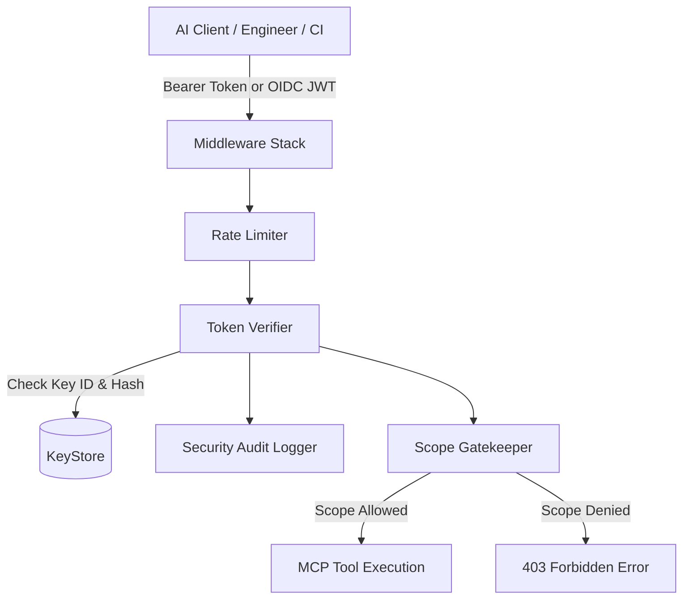

# Security Architecture & Authentication Model

This document explains how ArchMCP handles authentication, API keys, permissions (RBAC), rate limiting, and security logs.

---

## 1. Architecture Overview



---

## 2. Authentication & Keys

### Key Format
API keys use this format:
```text
arch_{environment}_{kid}_{secret}
```
* **`arch`**: Prefix identifier
* **`environment`**: `live`, `test`, or `dev`
* **`kid`**: 12-character public Key ID used for quick lookup
* **`secret`**: 32-byte random token

### Storage & Verification
* **No plaintext secrets**: Raw secret tokens are printed once when generated and never stored on disk in plaintext.
* **Salted HMAC-SHA256**: The KeyStore saves a random salt and HMAC-SHA256 hash of the secret.
* **Constant-time comparison**: Verification uses `hmac.compare_digest` to prevent timing attacks.

---

## 3. Permissions & Scopes (RBAC)

ArchMCP uses scopes to control what tools an API key can call:

| MCP Tool | Required Scope | Viewer | Developer | Architect | Admin |
| :--- | :--- | :---: | :---: | :---: | :---: |
| `scan_repository` | `arch:read` | ✅ | ✅ | ✅ | ✅ |
| `search_microservices` | `arch:read` | ✅ | ✅ | ✅ | ✅ |
| `list_all_services` | `arch:read` | ✅ | ✅ | ✅ | ✅ |
| `get_service_details` | `arch:read` | ✅ | ✅ | ✅ | ✅ |
| `get_service_apis` | `arch:read` | ✅ | ✅ | ✅ | ✅ |
| `get_service_dependencies`| `arch:read` | ✅ | ✅ | ✅ | ✅ |
| `find_api_owner` | `arch:read` | ✅ | ✅ | ✅ | ✅ |
| `get_full_context_package`| `arch:read` | ✅ | ✅ | ✅ | ✅ |
| `generate_sequence_diagram`| `arch:diagram` | ❌ | ✅ | ✅ | ✅ |
| `get_database_schema` | `arch:schema:read` | ❌ | ❌ | ✅ | ✅ |
| `find_table_owner` | `arch:schema:read` | ❌ | ❌ | ✅ | ✅ |
| `analyze_blast_radius` | `arch:blast_radius` | ❌ | ❌ | ✅ | ✅ |
| `import_openapi` | `arch:write` | ❌ | ❌ | ✅ | ✅ |
| `archmcp keys *` | `arch:admin` / `*` | ❌ | ❌ | ❌ | ✅ |

---

## 4. Rate Limiting

To prevent runaway loops from AI clients or DDoS, ArchMCP uses an in-memory sliding window rate limiter (default: 60 requests per minute per key).

When a client makes requests, the server includes standard headers:
* `X-RateLimit-Limit`: Maximum allowed requests per window
* `X-RateLimit-Remaining`: Remaining requests in current window
* `X-RateLimit-Reset`: Seconds until quota resets

If the limit is exceeded, the server returns HTTP status `429 Too Many Requests`.

---

## 5. Security Audit Logging

All key creations, rotations, revocations, and tool invocations are written to an append-only JSON audit log:

```json
{
  "event_id": "aud_01j7b8y...",
  "timestamp": "2026-08-30T12:00:00.000000Z",
  "event_type": "TOOL_INVOCATION",
  "actor": "alice@company.com",
  "tenant_id": "default",
  "action": "tool:analyze_blast_radius",
  "status": "ALLOWED",
  "details": {
    "service_id": "auth-service"
  }
}
```

---

## 6. OIDC & Corporate IdP Support

If you use Okta, Microsoft Entra ID (Azure AD), Auth0, or Keycloak, ArchMCP can validate JWT bearer tokens directly. It maps IdP roles or groups to ArchMCP scopes and isolates records by `tenant_id`.
